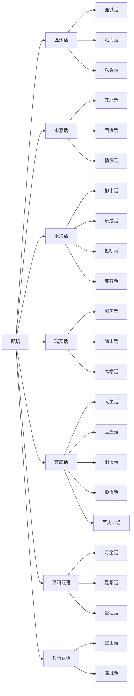

# 瓯语方言示意图

```mermaid
graph LR;
    瓯语-->温州话;
    温州话-->鹿城话;
    温州话-->瓯海话;
    温州话-->永强话;
    瓯语-->永嘉话;
    永嘉话-->江北话;
    永嘉话-->西溪话;
    永嘉话-->楠溪话;
    瓯语-->乐清话;
    乐清话-->柳市话;
    乐清话-->乐成话;
    乐清话-->虹桥话;
    乐清话-->芙蓉话;
    瓯语-->瑞安话;
    瑞安话-->城区话;
    瑞安话-->陶山话;
    瑞安话-->高楼话;
    瓯语-->文成话;
    文成话-->大峃话;
    文成话-->玉壶话;
    文成话-->珊溪话;
    文成话-->顺溪话;
    文成话-->百丈口话;
    瓯语-->平阳瓯语;
    平阳瓯语-->万全话;
    平阳瓯语-->昆阳话;
    平阳瓯语-->鳌江话;
    瓯语-->苍南瓯语;
    苍南瓯语-->宜山话;
    苍南瓯语-->蒲城话;
```
